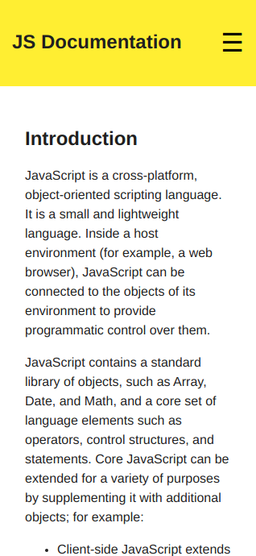
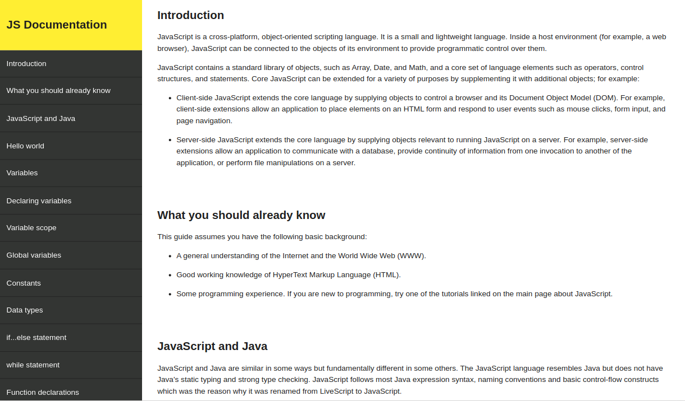

# FCC - Technical Documentation Page
This project is realized as part of FreeCodeCamp Responsive Web Design project  
## Specifications
See related user stories :  
https://www.freecodecamp.org/learn/responsive-web-design/responsive-web-design-projects/build-a-technical-documentation-page 

## Stack
* HTML
* CSS
* Javascript (menu toggle for small devices)  
## Screenshots
Mobile :
 

Desktop :
 

